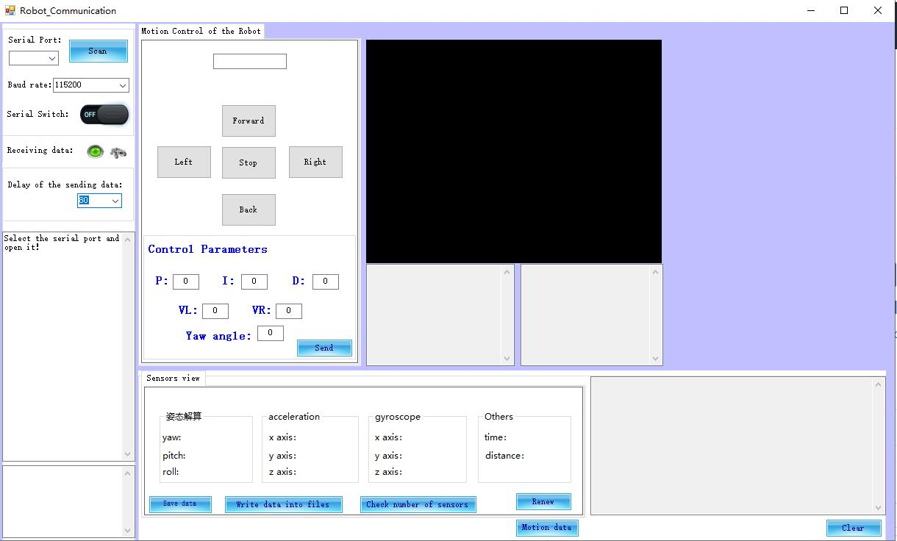
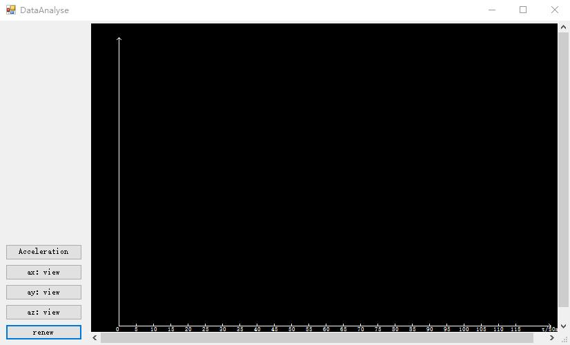

# Mobile_robot_interface
This is a mobile robot human-computer interaction interface written in C#:
The project can show the details of the serial port and its connection state.
Also it playss a role of the communication between robots and computer for the analysis in later step.
It can also be used for curve analysis.

The view of the project:

